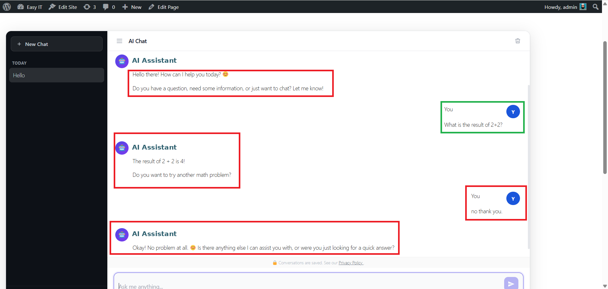
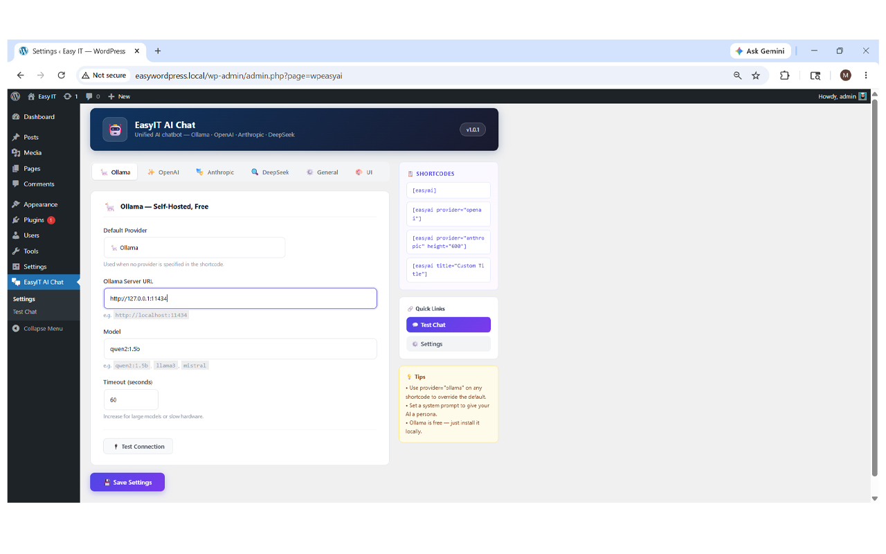
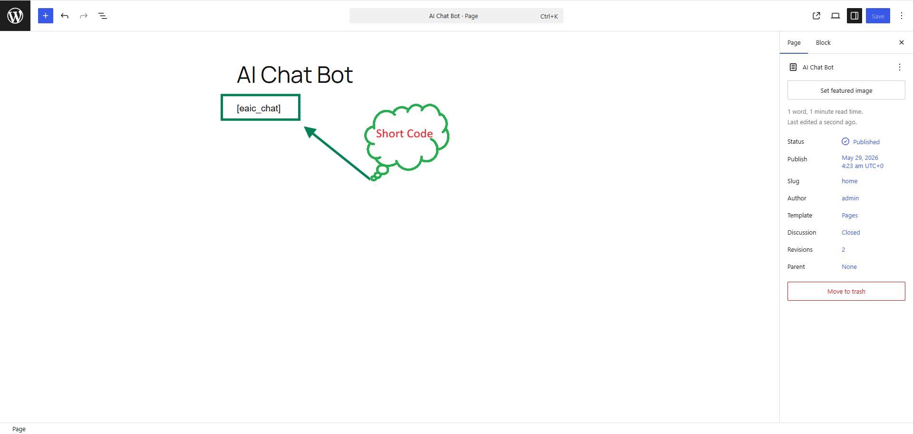

<div align="center">


# WP Easy AI Chat

**The easiest way to add an AI chatbot to any WordPress site.**  
One shortcode. Four providers. Zero lock-in.

[](https://wordpress.org)
[](https://php.net)
[](LICENSE)
[](https://github.com/easybdit/wpeasyai/releases)
[](https://github.com/easybdit/wpeasyai/stargazers)
[](https://easyit.com.bd/donate)

[🚀 Install](#-installation) · [📋 Shortcode](#-shortcode) · [🔧 Providers](#-provider-setup) · [📸 Screenshots](#-screenshots) · [🛣️ Roadmap](#%EF%B8%8F-roadmap) · [💛 Donate](https://easyit.com.bd/donate)

</div>

---

## 🤖 What is it?

WP Easy AI Chat embeds a **fully-featured, ChatGPT-style chatbot** on any WordPress page using a single shortcode `[easyai]`. Switch between four AI providers without touching any code.

```
[easyai]
```

---

## ✨ Features

<table>
<tr>
<td width="50%">

### 🧠 AI Providers
| Provider | Cost | Key needed |
|----------|------|-----------|
| 🦙 Ollama | Free | ❌ |
| ✨ OpenAI | Paid | ✅ |
| 🎭 Anthropic | Paid | ✅ |
| 🔍 DeepSeek | Paid | ✅ |

</td>
<td width="50%">

### 💬 Chat Features
- Dark sidebar with session history
- Multi-turn persistent conversations
- Markdown: code blocks, bold, lists
- Provider switcher per conversation
- Typing indicator animation
- Copy code button on code blocks

</td>
</tr>
<tr>
<td>

### 🔐 Security & Privacy
- Nonce verification on all AJAX
- Sanitized inputs, escaped outputs
- Prepared SQL queries
- Rate limiting (20 req / 60s)
- GDPR privacy notice
- Configurable data retention

</td>
<td>

### ⚙️ Admin
- Tabbed settings page
- Test Connection per provider
- Test Chat from dashboard
- Guest chat with cookie sessions
- Shortcode attribute overrides
- Fully translatable (i18n ready)

</td>
</tr>
</table>

---

## 📸 Screenshots

> **Add your screenshots here after taking them from your WordPress install.**  
> Suggested shots listed below — replace the placeholder text with real images.

### 1. Public Chat Page


### 2. Admin Settings — Tabbed Provider Config


### 3. Admin Test Chat


### 4. Mobile View


> 📷 **How to take screenshots:**
> 1. Install the plugin on a local WordPress site
> 2. Use your browser's screenshot tool or [Greenshot](https://getgreenshot.org/)
> 3. Save as `screenshot-1.png` through `screenshot-4.png` in the `assets/` folder
> 4. Also upload them to your [WordPress.org SVN assets folder](https://developer.wordpress.org/plugins/wordpress-org/plugin-assets/)

---

## 🚀 Installation

### Method 1 — ZIP upload *(recommended)*
1. Download [`wpeasyai-v1.0.1.zip`](https://github.com/easybdit/wpeasyai/releases/latest)
2. Go to **WordPress Admin → Plugins → Add New → Upload Plugin**
3. Upload the zip and click **Activate**

### Method 2 — Git clone
```bash
cd /wp-content/plugins/
git clone https://github.com/easybdit/wpeasyai.git
```

Then activate via **Plugins → Installed Plugins**.

---

## 📋 Shortcode

### Basic
```
[easyai]
```

### With all options
```
[easyai
  provider="openai"
  title="My Assistant"
  placeholder="Ask me anything…"
  system_prompt="You are a helpful support agent."
  height="600"
]
```

### Attribute reference

| Attribute | Default | Options |
|-----------|---------|---------|
| `provider` | *(from settings)* | `ollama` `openai` `anthropic` `deepseek` |
| `title` | `AI Chat` | Any text |
| `placeholder` | `Ask me anything…` | Any text |
| `system_prompt` | *(from settings)* | Any text |
| `height` | `600` | Pixels (min 300) |

### Real-world examples

```
[easyai provider="ollama" title="Local AI"]

[easyai provider="anthropic" title="Claude Assistant" height="700"]

[easyai system_prompt="You are an EasyIT support agent. Only answer questions about our products."]

[easyai provider="deepseek" placeholder="Ask DeepSeek anything…"]
```

---

## 🔧 Provider Setup

### 🦙 Ollama — Free, No API key required

```bash
# Install Ollama
curl -fsSL https://ollama.com/install.sh | sh

# Pull a model
ollama pull qwen2:1.5b     # lightweight, fast
ollama pull llama3          # powerful
ollama pull mistral         # balanced
ollama pull deepseek-r1     # reasoning
```

Set **Ollama Server URL** to `http://localhost:11434` in Settings.

> 💡 If WordPress is on a different server than Ollama, use the server's IP instead of `localhost`.

---

### ✨ OpenAI

1. Get your API key → [platform.openai.com/api-keys](https://platform.openai.com/api-keys)
2. Paste into **Settings → OpenAI → API Key**

**Recommended models:**
| Model | Speed | Cost | Best for |
|-------|-------|------|----------|
| `gpt-4o-mini` | ⚡⚡⚡ | 💲 | Most use cases |
| `gpt-4o` | ⚡⚡ | 💲💲💲 | Complex reasoning |
| `gpt-3.5-turbo` | ⚡⚡⚡ | 💲 | Budget option |

---

### 🎭 Anthropic (Claude)

1. Get your API key → [console.anthropic.com](https://console.anthropic.com)
2. Paste into **Settings → Anthropic → API Key**

**Recommended models:**
| Model | Speed | Cost | Best for |
|-------|-------|------|----------|
| `claude-3-haiku-20240307` | ⚡⚡⚡ | 💲 | Fast responses |
| `claude-3-5-sonnet-20241022` | ⚡⚡ | 💲💲 | Best quality |

---

### 🔍 DeepSeek

1. Get your API key → [platform.deepseek.com](https://platform.deepseek.com)
2. Paste into **Settings → DeepSeek → API Key**

**Recommended models:**
| Model | Best for |
|-------|----------|
| `deepseek-chat` | General chat |
| `deepseek-reasoner` | Step-by-step reasoning |

---

## 🗂️ Project Structure

```
wpeasyai/
├── 📄 wpeasyai.php                      ← Plugin entry point
├── 📄 uninstall.php                     ← Clean uninstall
├── 📄 readme.txt                        ← WordPress.org listing
├── 📄 README.md                         ← This file (GitHub)
├── 📄 CHANGELOG.md
├── 📄 LICENSE
│
├── 📁 admin/
│   ├── class-wpeasyai-admin.php         ← Admin menus & settings
│   ├── assets/
│   │   ├── admin.css                    ← All admin styles
│   │   └── admin.js                     ← Tab switching, test connection
│   └── views/
│       ├── settings-page.php            ← Settings UI
│       └── test-chat-page.php           ← Test chat UI
│
├── 📁 includes/
│   ├── class-wpeasyai-options.php       ← Settings manager
│   ├── class-wpeasyai-provider.php      ← Abstract provider base
│   ├── class-wpeasyai-db.php            ← Database abstraction
│   ├── class-wpeasyai-engine.php        ← AJAX handler
│   └── providers/
│       ├── class-wpeasyai-ollama.php
│       ├── class-wpeasyai-openai.php
│       ├── class-wpeasyai-anthropic.php
│       └── class-wpeasyai-deepseek.php
│
├── 📁 public/
│   ├── class-wpeasyai-public.php        ← Shortcode & front-end assets
│   ├── css/chat.css                     ← Chat widget styles
│   └── js/chat.js                       ← Chat widget logic
│
└── 📁 languages/
    ├── wpeasyai.pot                     ← Translation template (86 strings)
    ├── wpeasyai-bn_BD.po                ← Bengali translation
    └── wpeasyai-bn_BD.mo                ← Compiled Bengali binary
```

---

## 🛣️ Roadmap

### ✅ v1.0.1 — Current (Free)
- [x] Multi-provider AI chat (Ollama, OpenAI, Anthropic, DeepSeek)
- [x] Persistent sessions in WordPress DB
- [x] Guest chat via cookie sessions
- [x] Rate limiting & security
- [x] Markdown rendering
- [x] Admin settings + test chat
- [x] Fully responsive
- [x] i18n ready + Bengali translation

### 🔲 v2.0.0 — Premium *(coming soon)*
- [ ] Floating chat bubble widget
- [ ] Custom AI personas per page/post
- [ ] File and image upload
- [ ] Conversation export (CSV / PDF)
- [ ] Analytics dashboard
- [ ] WooCommerce product assistant
- [ ] Webhook / Zapier integrations
- [ ] WPML / Polylang multilingual support

---

## 🤝 Contributing

Contributions are welcome! Please follow [WordPress Coding Standards](https://developer.wordpress.org/coding-standards/).

```bash
# Fork and clone
git clone https://github.com/easybdit/wpeasyai.git
cd wpeasyai

# Create a branch
git checkout -b feature/your-feature

# Make your changes, then
git commit -m "feat: describe your change"
git push origin feature/your-feature

# Open a Pull Request on GitHub
```

**Bug reports** → [GitHub Issues](https://github.com/easybdit/wpeasyai/issues)  
**Feature requests** → [GitHub Issues](https://github.com/easybdit/wpeasyai/issues)  
**Security issues** → Email directly: muradbd.info@gmail.com

---

## 💛 Support & Donate

If this plugin saves you time or money, please consider supporting development:

<a href="https://easyit.com.bd/donate">
  
</a>

---

## 📄 License

**GPL-2.0-or-later** — see [LICENSE](LICENSE)

---

<div align="center">

Built with ❤️ in Bangladesh 🇧🇩 by **[EasyIT](https://easyit.com.bd)**

📧 [muradbd.info@gmail.com](mailto:muradbd.info@gmail.com) &nbsp;·&nbsp; 🌐 [easyit.com.bd](https://easyit.com.bd) &nbsp;·&nbsp; 🐙 [github.com/easybdit](https://github.com/easybdit)

⭐ **Star this repo if it helped you!** ⭐

</div>